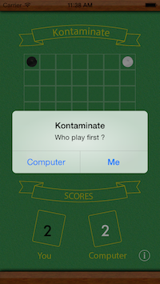
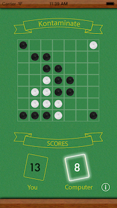
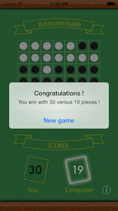
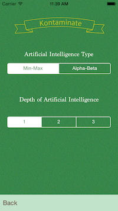

Kontaminate
====================

A virus game for iOS with two artificial intelligence types and depth (min-max | alpha-beta).

Made for iPhone 5 / iOS 6, fully working in iOS 7.

Objectives
---------------------

Working on Artificial Intelligence, implementation of Min-Max & Alpha-Beta Heuristic algorithms.

School project made by [William Klein](http://www.williamklein.name "William Klein") @[ITESCIA](http://www.itescia.fr/ "ITESCIA") for [M. CAZENAVE](https://www.linkedin.com/profile/view?id=52600480&locale=fr_FR&trk=tyah&trkInfo=tarId%3A1395744492492%2Ctas%3Acazenave%2Cidx%3A1-1-1 "ITESCIA").

Screenshots
---------------------

Licence
----------------------
Apache License Version 2.0